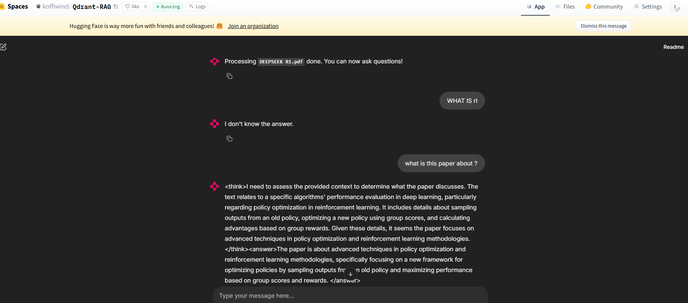

# Deploying RAG powered by Qdrant as vector db and fastembed for embedding and retrieval

#### ❓ QUESTION #1:

Why do we want to support streaming? What about streaming is important, or useful?

####  ANSWER #1:

The goal of streaming in this context is to render the generated answers in chunks. Thus reducing latency specifically for answers containing a lot of tokens

#### ❓ QUESTION #2: 

Why are we using User Session here? What about Python makes us need to use this? Why not just store everything in a global variable?

####  ANSWER #2:

Users sessions are used to keep track of users activity. It can be used to retrieve contxt from previous conversations or separate conversions

#### ❓ Discussion Question #1:

Upload a PDF file of the recent DeepSeek-R1 paper and ask the following questions:

1. What is RL and how does it help reasoning?
2. What is the difference between DeepSeek-R1 and DeepSeek-R1-Zero?
3. What is this paper about?

Does this application pass your vibe check? Are there any immediate pitfalls you're noticing?

#### ❓ Discussion

Yes The application passes the vibe check except for the last question but it is normal behaviour. My collection had documents from another uploaded PDF

## 🚧 CHALLENGE MODE 🚧

Added Qdrant as vector db

Hugging Face Space link : 
